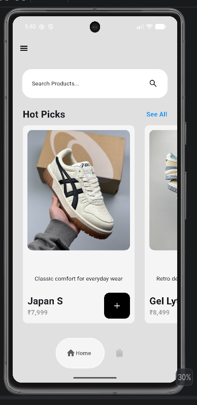
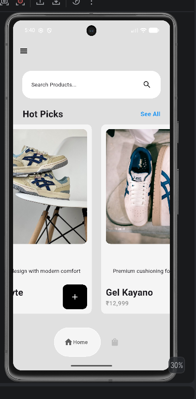
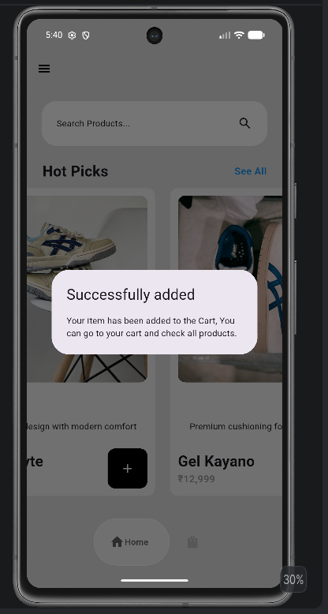
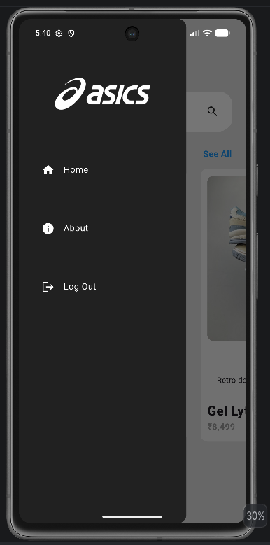
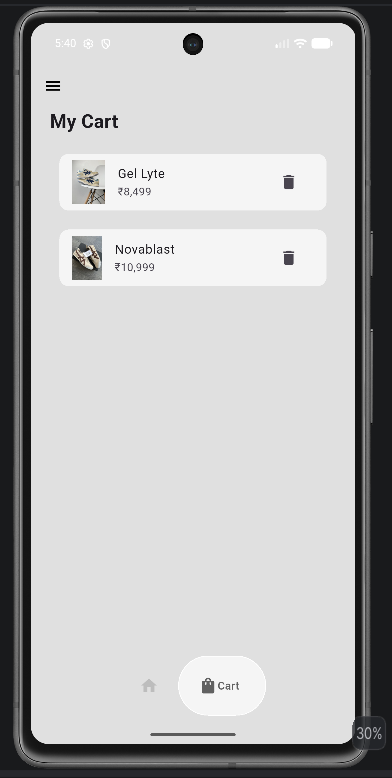

# 👟 Simple Flutter Sneaker Shop App

A simple Flutter application built to practice Flutter fundamentals such as layouts, navigation, state management using **Provider**, reusable widgets, and basic cart functionality.

## ✨ Features

- 🏠 Home Screen
- 👟 Browse Sneakers
- 🛒 Add to Cart
- 🧺 View Cart
- 📱 Clean and Responsive UI
- ⚡ State Management using Provider

## 🛠️ Tech Stack

- Flutter
- Dart
- Provider

## 📸 Demo

### Home Page
<p align="center">
  
</p>

### Product Listing
<p align="center">
  
</p>

### Add to Cart
<p align="center">
  
</p>

### More Products
<p align="center">
  
</p>

### Cart Page
<p align="center">
  
</p>

## 🚀 Getting Started

1. Clone the repository

```bash
git clone https://github.com/your-username/your-repository.git
````

2. Navigate to the project

```bash
cd your-repository
```

3. Install dependencies

```bash
flutter pub get
```

4. Run the app

```bash
flutter run
```

## 📂 Project Structure

```
lib/
├── components/
├── models/
├── pages/
├── themes/
└── main.dart
```

## 📌 Learning Objectives

This project was built to learn:

* Flutter Widgets
* Stateful & Stateless Widgets
* Navigation
* Provider State Management
* Reusable UI Components
* Flutter Project Structure

## 🤝 Contributing

Feel free to fork this repository and submit pull requests for improvements.

## 📄 License

This project is open source and available under the MIT License.

